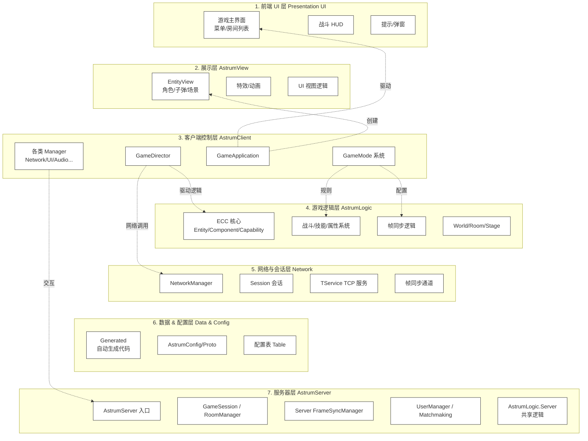

# Astrum 项目架构图 (Mermaid 版)

```mermaid
graph TB
    %% 定义样式
    classDef layerUI fill:#CFF8E6,stroke:#333,stroke-width:1px;
    classDef layerView fill:#E3FFD2,stroke:#333,stroke-width:1px;
    classDef layerClient fill:#FFE7C6,stroke:#333,stroke-width:1px;
    classDef layerLogic fill:#FFF8C6,stroke:#333,stroke-width:1px;
    classDef layerNet fill:#F4D8FF,stroke:#333,stroke-width:1px;
    classDef layerData fill:#E2F5FF,stroke:#333,stroke-width:1px;
    classDef layerServer fill:#FFD6D6,stroke:#333,stroke-width:1px;
    classDef nodeWhite fill:#FFFFFF,stroke:#333,stroke-width:1px;

    %% 1. 前端 UI 层
    subgraph L1 [1. 前端 UI 层 Presentation UI]
        direction TB
        UI_Main[游戏主界面<br/>菜单/房间列表]:::nodeWhite
        UI_HUD[战斗 HUD]:::nodeWhite
        UI_Popup[提示/弹窗]:::nodeWhite
    end
    class L1 layerUI

    %% 2. 展示层
    subgraph L2 [2. 展示层 AstrumView]
        direction TB
        V_Entity[EntityView<br/>角色/子弹/场景]:::nodeWhite
        V_FX[特效/动画]:::nodeWhite
        V_Logic[UI 视图逻辑]:::nodeWhite
    end
    class L2 layerView

    %% 3. 客户端控制层
    subgraph L3 [3. 客户端控制层 AstrumClient]
        direction TB
        C_App[GameApplication]:::nodeWhite
        C_Director[GameDirector]:::nodeWhite
        C_Mode[GameMode 系统]:::nodeWhite
        C_Mgr[各类 Manager<br/>Network/UI/Audio...]:::nodeWhite
    end
    class L3 layerClient

    %% 4. 游戏逻辑层
    subgraph L4 [4. 游戏逻辑层 AstrumLogic]
        direction TB
        L_ECC[ECC 核心<br/>Entity/Component/Capability]:::nodeWhite
        L_Combat[战斗/技能/属性系统]:::nodeWhite
        L_Frame[帧同步逻辑]:::nodeWhite
        L_World[World/Room/Stage]:::nodeWhite
    end
    class L4 layerLogic

    %% 5. 网络与会话层
    subgraph L5 [5. 网络与会话层 Network]
        direction TB
        N_Mgr[NetworkManager]:::nodeWhite
        N_Session[Session 会话]:::nodeWhite
        N_TCP[TService TCP 服务]:::nodeWhite
        N_Chan[帧同步通道]:::nodeWhite
    end
    class L5 layerNet

    %% 6. 数据配置层
    subgraph L6 [6. 数据 & 配置层 Data & Config]
        direction TB
        D_Gen[Generated<br/>自动生成代码]:::nodeWhite
        D_Proto[AstrumConfig/Proto]:::nodeWhite
        D_Table[配置表 Table]:::nodeWhite
    end
    class L6 layerData

    %% 7. 服务器层
    subgraph L7 [7. 服务器层 AstrumServer]
        direction TB
        S_Server[AstrumServer 入口]:::nodeWhite
        S_Room[GameSession / RoomManager]:::nodeWhite
        S_Frame[Server FrameSyncManager]:::nodeWhite
        S_User[UserManager / Matchmaking]:::nodeWhite
        S_Logic[AstrumLogic.Server<br/>共享逻辑]:::nodeWhite
    end
    class L7 layerServer

    %% ================= 跨层连线 =================
    %% 使用虚线表示穿插调用关系
    
    C_App -.->|驱动| UI_Main
    C_App -.->|创建| V_Entity

    C_Director -.->|驱动逻辑| L_ECC
    C_Director -.->|网络调用| N_Mgr

    C_Mode -.->|规则| L_Combat
    C_Mode -.->|配置| L_Frame

    C_Mgr -.->|交互| S_Server

    %% 强制层级顺序的隐藏线 (Mermaid 自动布局通常不需要，但加上更保险)
    L1 ~~~ L2
    L2 ~~~ L3
    L3 ~~~ L4
    L4 ~~~ L5
    L5 ~~~ L6
    L6 ~~~ L7
```

