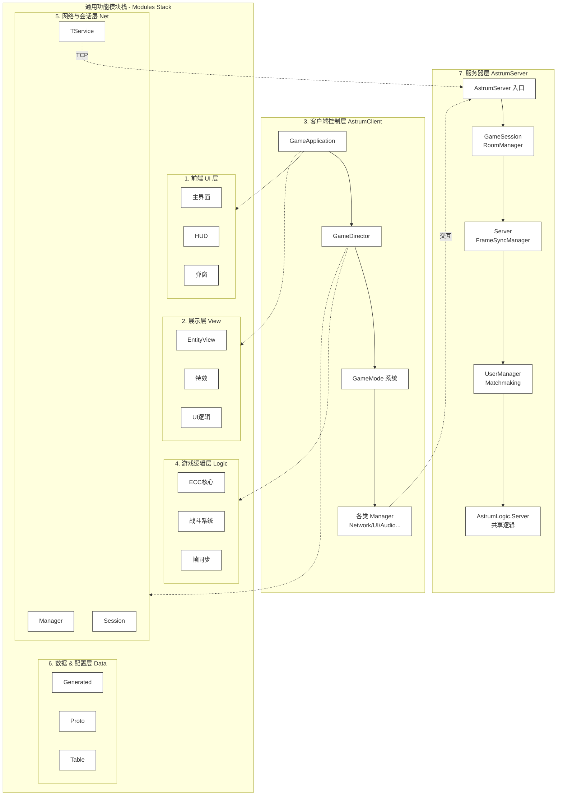

# Astrum 项目架构图 (三列容器版)

```mermaid
graph TB
    %% 定义样式
    classDef layerUI fill:#CFF8E6,stroke:#333,stroke-width:1px;
    classDef layerView fill:#E3FFD2,stroke:#333,stroke-width:1px;
    classDef layerClient fill:#FFE7C6,stroke:#333,stroke-width:1px;
    classDef layerLogic fill:#FFF8C6,stroke:#333,stroke-width:1px;
    classDef layerNet fill:#F4D8FF,stroke:#333,stroke-width:1px;
    classDef layerData fill:#E2F5FF,stroke:#333,stroke-width:1px;
    classDef layerServer fill:#FFD6D6,stroke:#333,stroke-width:1px;
    classDef nodeWhite fill:#FFFFFF,stroke:#333,stroke-width:1px;
    classDef containerBox fill:#F9F9F9,stroke:#666,stroke-width:2px,stroke-dasharray: 5 5;

    %% ================= 第一列：服务器层 (左) =================
    subgraph Col_Server [7. 服务器层 AstrumServer]
        direction TB
        S_Server[AstrumServer 入口]:::nodeWhite
        S_Room[GameSession<br/>RoomManager]:::nodeWhite
        S_Frame[Server<br/>FrameSyncManager]:::nodeWhite
        S_User[UserManager<br/>Matchmaking]:::nodeWhite
        S_Logic[AstrumLogic.Server<br/>共享逻辑]:::nodeWhite

        %% 内部竖排
        S_Server --> S_Room --> S_Frame --> S_User --> S_Logic
    end
    class Col_Server layerServer

    %% ================= 第二列：客户端控制层 (中) =================
    subgraph Col_Client [3. 客户端控制层 AstrumClient]
        direction TB
        C_App[GameApplication]:::nodeWhite
        C_Director[GameDirector]:::nodeWhite
        C_Mode[GameMode 系统]:::nodeWhite
        C_Mgr[各类 Manager<br/>Network/UI/Audio...]:::nodeWhite
        
        %% 内部竖排
        C_App --> C_Director --> C_Mode --> C_Mgr
    end
    class Col_Client layerClient

    %% ================= 第三列：通用功能模块栈 (右) =================
    %% 修复：移除标题中的圆括号，改用中括号或无符号
    subgraph Col_Modules ["通用功能模块栈 - Modules Stack"]
        direction TB
        
        %% 1. UI 层
        subgraph L1 [1. 前端 UI 层]
            direction LR
            UI_Main[主界面]:::nodeWhite
            UI_HUD[HUD]:::nodeWhite
            UI_Popup[弹窗]:::nodeWhite
        end
        class L1 layerUI

        %% 2. 展示层
        subgraph L2 [2. 展示层 View]
            direction LR
            V_Entity[EntityView]:::nodeWhite
            V_FX[特效]:::nodeWhite
            V_Logic[UI逻辑]:::nodeWhite
        end
        class L2 layerView

        %% 4. 逻辑层
        subgraph L4 [4. 游戏逻辑层 Logic]
            direction LR
            L_ECC[ECC核心]:::nodeWhite
            L_Combat[战斗系统]:::nodeWhite
            L_Frame[帧同步]:::nodeWhite
        end
        class L4 layerLogic

        %% 5. 网络层
        subgraph L5 [5. 网络与会话层 Net]
            direction LR
            N_Mgr[Manager]:::nodeWhite
            N_Session[Session]:::nodeWhite
            N_TCP[TService]:::nodeWhite
        end
        class L5 layerNet

        %% 6. 数据层
        subgraph L6 [6. 数据 & 配置层 Data]
            direction LR
            D_Gen[Generated]:::nodeWhite
            D_Proto[Proto]:::nodeWhite
            D_Table[Table]:::nodeWhite
        end
        class L6 layerData

        %% 模块内部顺序
        L1 ~~~ L2 ~~~ L4 ~~~ L5 ~~~ L6
    end
    class Col_Modules containerBox

    %% ================= 列与列的左右布局控制 =================
    Col_Server ~~~ Col_Client ~~~ Col_Modules

    %% ================= 跨列的逻辑连线 =================
    %% 1. Client -> Server (中 -> 左)
    C_Mgr -.->|交互| S_Server

    %% 2. Client -> Modules (中 -> 右)
    C_App -.-> L1
    C_App -.-> L2
    C_Director -.-> L4
    C_Director -.-> L5
    
    %% 3. Modules -> Server (右 -> 左)
    N_TCP -.->|TCP| S_Server

```
