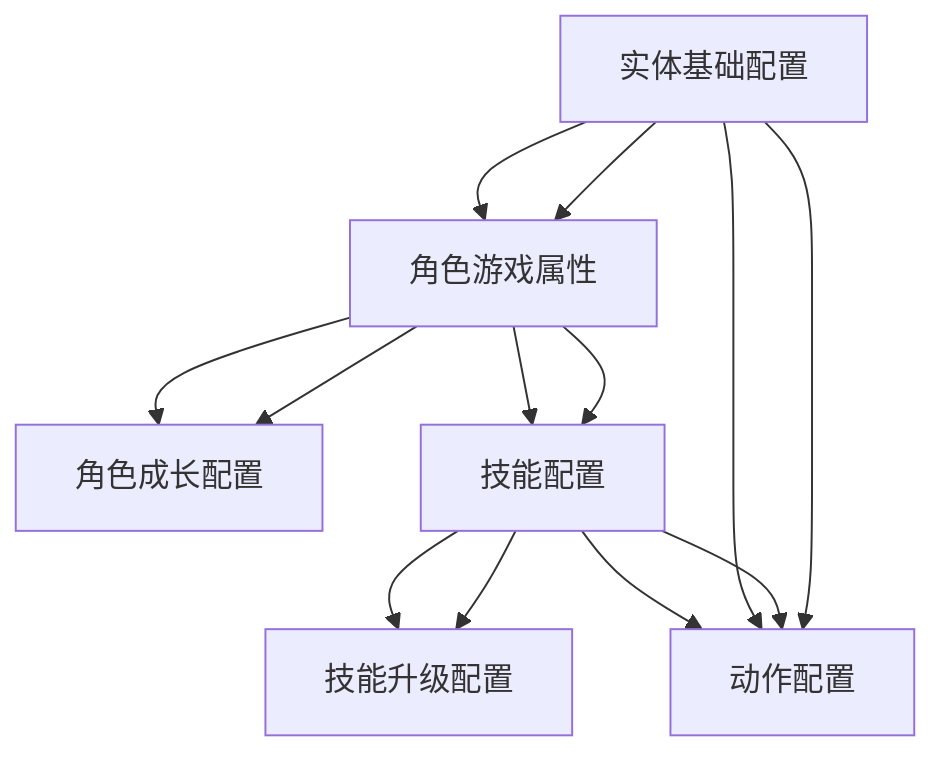

# Astrum 表格配置说明文档

## 📋 概述

本文档详细说明了Astrum项目中所有表格配置的作用、结构和关系。表格配置使用Luban框架进行数据驱动，支持热更新和多平台部署。

## 🏗️ 表格架构

### 核心设计理念
- **数据驱动**：所有游戏配置通过表格管理，支持策划直接修改
- **职责分离**：不同表格负责不同的游戏系统，职责清晰
- **关系明确**：表格间通过ID关联，形成完整的数据网络
- **扩展性强**：支持新功能、新内容的热更新

### 表格分类
```
表格配置系统
├── 实体系统 (Entity/)
│   ├── EntityBaseTable - 实体基础配置
│   ├── EntityModelTable - 实体模型配置  
│   └── ActionTable - 动作配置
├── 角色系统 (Role/)
│   ├── RoleBaseTable - 角色基础属性
│   └── RoleGrowthTable - 角色成长配置
├── 技能系统 (Skill/)
│   ├── SkillTable - 技能配置
│   ├── SkillActionTable - 技能动作配置
│   └── SkillEffectTable - 技能效果配置
└── 通用系统
    └── ItemTable - 道具配置
```

## 📊 表格详细说明

## 🔧 Luban格式规范

### 基本格式要求
- **文件命名**：使用`#`前缀，如`#SkillTable.csv`
- **头部格式**：必须包含`##var`, `##type`, `##group`, `##desc`四行
- **逗号对齐**：所有行的逗号数量必须完全一致
- **编码格式**：使用UTF-8编码，避免中文乱码

### 数据类型规范
| 类型 | Luban语法 | 示例 | 说明 |
|------|-----------|------|------|
| 整数 | `int` | `123` | 32位整数 |
| 浮点数 | `float` | `123.45` | 单精度浮点数 |
| 字符串 | `string` | `"Hello"` | 文本字符串 |
| 布尔值 | `bool` | `true` | 真/假值 |
| 数组 | `array,元素类型` | `array,int` | 元素数组 |
| 带分隔符数组 | `array,元素类型#sep=分隔符` | `array,int#sep==` | 指定分隔符的数组 |

### 数组类型详解
Luban不支持`int[]`语法，必须使用`array,类型`格式：

#### 基本数组语法
```csv
##var,id,items
##type,int,array,int
##group,,,
##desc,ID,Item List
,1,1001,1002,1003
```

#### 带分隔符数组语法
```csv
##var,id,items
##type,int,array,int#sep==
##group,,,
##desc,ID,Item List
,1,1001==1002==1003
```

#### 常用分隔符
- **逗号分隔**：`array,int#sep=,` → `"1001,1002,1003"`
- **等号分隔**：`array,int#sep==` → `1001==1002==1003`
- **竖线分隔**：`array,string#sep=|` → `"a|b|c"`
- **分号分隔**：`array,float#sep=;` → `"1.0;2.0;3.0"`

### 常见错误及解决方案
1. **数组类型错误**：`int[]` → 改为 `array,int`
2. **分隔符错误**：`array,int#sep=,` → 确保分隔符在数据中正确使用
3. **逗号数量不匹配**：检查所有行的逗号数量是否一致
4. **编码问题**：使用UTF-8编码，避免中文乱码

## 📊 表格详细说明

### 1. 实体系统表格

#### 1.1 EntityBaseTable (实体基础表格)
**文件位置**: `Datas/Entity/#EntityBaseTable.xlsx`

**作用**: 定义游戏中所有实体的基础配置，包括模型、动作等通用属性。

**字段说明**:
| 字段名 | 类型 | 描述 | 示例值 |
|--------|------|------|--------|
| EntityId | int | 实体唯一标识符 | 1001 |
| ModelName | string | 模型名称 | "Knight_Model" |
| ModelPath | string | 模型资源路径 | "Models/Characters/Knight" |
| IdleAction | int | 待机动作ID | 1000 |
| WalkAction | int | 走路动作ID | 1001 |
| RunAction | int | 跑步动作ID | 1002 |
| JumpAction | int | 跳跃动作ID | 1003 |
| BirthAction | int | 出生动作ID | 1004 |
| DeathAction | int | 死亡动作ID | 1005 |

**使用场景**: 
- 实体创建时获取基础配置
- 动作系统初始化时获取动作ID列表
- 模型加载时获取资源路径

#### 1.2 EntityModelTable (实体模型表格)
**文件位置**: `Datas/Entity/#EntityModelTable.xlsx`

**作用**: 定义实体模型的详细配置，包括资源路径、类型等。

**字段说明**:
| 字段名 | 类型 | 描述 | 示例值 |
|--------|------|------|--------|
| ModelId | int | 模型唯一标识符 | 2001 |
| ModelName | string | 模型名称 | "Knight_Model" |
| ModelPath | string | 模型资源路径 | "Models/Characters/Knight" |
| ModelType | int | 模型类型 | 1 |

#### 1.3 ActionTable (动作表格)
**文件位置**: `Datas/Entity/#ActionTable.xlsx`

**作用**: 定义所有动作的详细配置，包括动画、持续时间、命令等。

**字段说明**:
| 字段名 | 类型 | 描述 | 示例值 |
|--------|------|------|--------|
| ActionId | int | 动作唯一标识符 | 1000 |
| ActionName | string | 动作名称 | "Idle" |
| ActionType | string | 动作类型 | "idle" |
| Duration | int | 持续时间（帧） | 30 |
| AnimationName | string | 动画资源名称 | "Knight_Idle" |
| AutoNextActionId | int | 自动下一个动作ID | 1000 |
| KeepPlayingAnim | bool | 是否保持动画播放 | true |
| AutoTerminate | bool | 是否自动终止 | false |
| Command | string | 触发命令 | "move" |
| Priority | int | 优先级（越小越高） | 0 |
| CancelTags | string | 取消标签 | "attack,move" |
| BeCancelledTags | string | 被取消标签 | "idle" |
| TempBeCancelledTags | string | 临时被取消标签 | "" |

### 2. 角色系统表格

#### 2.1 RoleBaseTable (角色基础表格)
**文件位置**: `Datas/Role/#RoleBaseTable.xlsx`

**作用**: 定义玩家角色的游戏属性，包括基础属性、成长系数、技能配置等。支持轻重击双攻击系统。

**字段说明**:
| 字段名 | 类型 | 描述 | 示例值 |
|--------|------|------|--------|
| Id | int | 角色唯一标识符（对应EntityBaseTable.EntityId） | 1001 |
| Name | string | 角色名称 | "Knight" |
| Description | string | 角色描述 | "Balanced melee character with good attack and defense" |
| RoleType | int | 角色类型（1=剑士,2=弓手,3=法师,4=重锤者,5=刺客） | 1 |
| BaseLightAttack | float | 基础轻击攻击力 | 80.0 |
| BaseHeavyAttack | float | 基础重击攻击力 | 150.0 |
| BaseDefense | float | 基础防御力 | 80.0 |
| BaseHealth | float | 基础生命值 | 1000.0 |
| BaseSpeed | float | 基础移动速度 | 5.0 |
| LightAttackGrowth | float | 轻击攻击力成长系数 | 8.0 |
| HeavyAttackGrowth | float | 重击攻击力成长系数 | 15.0 |
| DefenseGrowth | float | 防御力成长系数 | 8.0 |
| HealthGrowth | float | 生命值成长系数 | 100.0 |
| SpeedGrowth | float | 移动速度成长系数 | 0.1 |
| LightAttackActionId | int | 轻击动作ID（鼠标左键） | 1001 |
| HeavyAttackActionId | int | 重击动作ID（鼠标右键） | 1002 |
| Skill1Id | int | 第一个技能ID（Q键） | 2001 |
| Skill2Id | int | 第二个技能ID（E键） | 2002 |
| MaxLevel | int | 最大等级 | 100 |
| ExpPerLevel | int | 每级所需经验值 | 1000 |

**轻重击系统说明**:
- **轻击 (Light Attack)**: 鼠标左键，快速、低伤、可连击
- **重击 (Heavy Attack)**: 鼠标右键，高伤、可格挡怪物轻型攻击
- 每个角色都有独立的轻击和重击数值，通过不同的ActionId关联到ActionTable

**关系说明**:
- `Id` 字段对应 `EntityBaseTable.EntityId`，建立实体与角色的关联
- `Skill1Id`/`Skill2Id` 对应 `SkillTable.Id`，建立角色与技能的关联

#### 2.2 RoleGrowthTable (角色成长表格)
**文件位置**: `Datas/Role/#RoleGrowthTable.xlsx`

**作用**: 定义角色在不同等级下的成长配置，包括属性加成、技能点等。支持轻重击分别成长。

**字段说明**:
| 字段名 | 类型 | 描述 | 示例值 |
|--------|------|------|--------|
| Id | int | 配置唯一标识符 | 1 |
| RoleId | int | 角色ID（关联RoleBaseTable.Id） | 1001 |
| Level | int | 等级 | 1 |
| RequiredExp | int | 升级所需经验值 | 1000 |
| LightAttackBonus | float | 轻击攻击力加成 | 8.0 |
| HeavyAttackBonus | float | 重击攻击力加成 | 15.0 |
| DefenseBonus | float | 防御力加成 | 8.0 |
| HealthBonus | float | 生命值加成 | 100.0 |
| SpeedBonus | float | 移动速度加成 | 0.1 |
| UnlockSkillId | int | 解锁的技能ID（0表示无） | 0 |
| SkillPoint | int | 获得的技能点 | 1 |

### 3. 技能系统表格

#### 3.1 SkillTable (技能表格)
**文件位置**: `Datas/Skill/#SkillTable.xlsx`

**作用**: 定义游戏中所有技能的配置信息，包括伤害、冷却、范围等。

**字段说明**:
| 字段名 | 类型 | 描述 | 示例值 |
|--------|------|------|--------|
| Id | int | 技能唯一标识符 | 2001 |
| Name | string | 技能名称 | "冲刺斩" |
| Description | string | 技能描述 | "向前冲刺并造成伤害" |
| SkillType | int | 技能类型（1=范围打击,2=控制,3=位移,4=强化,5=治疗） | 3 |
| ActionId | int | 对应动作ID（关联ActionTable.ActionId） | 1101 |
| Cooldown | float | 冷却时间（秒） | 5.0 |
| ManaCost | int | 法力消耗 | 20 |
| Damage | float | 基础伤害 | 150.0 |
| Range | float | 技能范围 | 5.0 |
| CastTime | float | 施法时间（秒） | 0.5 |
| TargetType | int | 目标类型（1=自身,2=单体,3=范围,4=直线） | 4 |
| EffectIds | string | 特效ID列表（逗号分隔） | "1001,1002" |
| SoundId | int | 音效ID | 3001 |
| IconId | int | 图标ID | 4001 |
| IsPassive | bool | 是否被动技能 | false |
| RequiredLevel | int | 学习所需等级 | 1 |
| MaxLevel | int | 技能最大等级 | 10 |

**关系说明**:
- `ActionId` 字段对应 `ActionTable.ActionId`，建立技能与动作的关联
- 通过 `RoleBaseTable.Skill1Id/Skill2Id` 建立角色与技能的关联

#### 3.2 SkillUpgradeTable (技能升级表格)
**文件位置**: `Datas/Skill/#SkillUpgradeTable.xlsx`

**作用**: 定义技能在不同等级下的属性提升和升级所需技能点。

**字段说明**:
| 字段名 | 类型 | 描述 | 示例值 |
|--------|------|------|--------|
| Id | int | 配置唯一标识符 | 1 |
| SkillId | int | 技能ID（关联SkillTable.Id） | 2001 |
| Level | int | 技能等级 | 1 |
| RequiredSkillPoint | int | 升级所需技能点 | 1 |
| DamageBonus | float | 伤害加成 | 15.0 |
| CooldownReduction | float | 冷却时间减少（秒） | 0.0 |
| ManaCostReduction | int | 法力消耗减少 | 0 |
| RangeBonus | float | 范围加成 | 0.0 |
| CastTimeReduction | float | 施法时间减少（秒） | 0.0 |
| EffectBonus | float | 效果加成 | 0.0 |

## 🔗 表格关系图



## 🚀 使用流程

### 1. 角色创建流程
```
1. 使用EntityBaseTable.EntityId创建实体
   ↓
2. 获取EntityBaseTable中的模型和动作配置
   ↓
3. 通过RoleBaseTable.Id获取角色游戏属性
   ↓
4. 初始化角色的基础属性和技能配置
```

### 2. 技能使用流程
```
1. 玩家按下Q/E键触发技能
   ↓
2. 通过RoleBaseTable.Skill1Id/Skill2Id获取技能ID
   ↓
3. 查询SkillTable获取技能配置信息
   ↓
4. 使用SkillTable.ActionId调用动作系统
   ↓
5. 根据技能配置应用伤害、效果等
```

### 3. 角色成长流程
```
1. 角色获得经验值
   ↓
2. 查询RoleGrowthTable检查是否升级
   ↓
3. 升级后应用属性加成和技能点
   ↓
4. 玩家分配技能点到SkillUpgradeTable配置的技能
```

## 📝 配置规范

### 1. ID命名规范
- **实体ID**: 1000-1999 (角色), 2000-2999 (怪物), 3000-3999 (NPC)
- **动作ID**: 1000-1999 (基础动作), 2000-2999 (技能动作), 3000-3999 (特殊动作)
- **技能ID**: 2000-2999 (角色技能), 3000-3999 (通用技能)
- **模型ID**: 2000-2999 (角色模型), 3000-3999 (怪物模型)

### 2. 数据类型规范
- **ID字段**: 使用int类型，必须唯一
- **名称字段**: 使用string类型，支持中文
- **数值字段**: 根据精度需求选择int或float
- **布尔字段**: 使用bool类型，表示开关状态

### 3. 关联关系规范
- **一对一关联**: 通过相同ID建立关联
- **一对多关联**: 通过外键ID建立关联
- **多对多关联**: 通过逗号分隔的ID字符串建立关联

## 🔧 工具使用

### 1. Luban配置生成
```bash
# 生成客户端配置
cd AstrumConfig/Tables
./gen_client.bat

# 生成服务器配置
./gen.bat

# 生成所有配置
./gen.sh
```

### 2. 配置验证
- 运行生成脚本后检查控制台输出
- 验证生成的.bytes文件大小
- 检查生成的C#代码是否正确

### 3. 热更新支持
- 修改Excel文件后重新生成配置
- 客户端可通过网络下载新的配置数据
- 支持运行时重新加载配置

## ⚠️ 注意事项

### 1. 数据一致性
- 修改关联ID时必须确保目标记录存在
- 删除记录前检查是否有其他记录引用
- 定期验证表格间的关联关系

### 2. 性能考虑
- 避免在表格中存储大量重复数据
- 合理设计索引字段，提高查询效率
- 考虑配置数据的内存占用

### 3. 版本管理
- 重要配置修改前备份原文件
- 记录配置变更的原因和影响
- 建立配置版本控制系统

---

**文档版本**: v1.0  
**创建时间**: 2025-01-22  
**最后更新**: 2025-01-22  
**维护者**: Astrum开发团队
