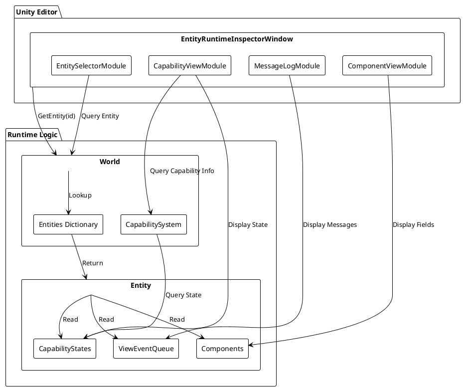

# Design: 实体运行时检查器编辑器窗口

## Context

在 ECC 架构中，实体（Entity）是游戏对象的核心，包含：
- **组件（Component）** - 存储数据，通过 `Entity.Components` 字典访问
- **Capability** - 包含逻辑，通过 `Entity.CapabilityStates` 字典和 `CapabilitySystem` 管理
- **消息队列** - 通过 `Entity.ViewEventQueue` 存储待处理的视图事件

开发人员需要在运行时查看这些信息以进行调试和开发。

## Goals / Non-Goals

### Goals

1. **实时查看实体状态** - 在运行时查看任意实体的组件数据和 Capability 状态
2. **消息日志追踪** - 查看发送给实体的消息，便于调试事件流
3. **易于使用** - 简单的实体选择机制（ID 输入或场景选择）
4. **性能友好** - 不影响运行时性能，仅在 Editor 模式下运行

### Non-Goals

1. **不修改实体数据** - 这是只读检查器，不支持编辑
2. **不支持历史回放** - 不记录历史状态，只显示当前状态
3. **不支持多实体对比** - 一次只查看一个实体
4. **不集成到游戏内 UI** - 这是 Editor 工具，不是游戏内功能

## Architecture

### 窗口结构

```
EntityRuntimeInspectorWindow (EditorWindow)
├── EntitySelectorModule      # 实体选择模块
│   ├── Entity ID 输入框
│   └── 实体信息显示（名称、配置ID等）
├── ComponentViewModule       # 组件展示模块
│   └── 组件列表（可折叠）
│       └── 每个组件的字段展示
├── CapabilityViewModule      # Capability 展示模块
│   └── Capability 列表（可折叠）
│       ├── 激活状态
│       ├── 优先级
│       ├── 标签
│       └── 持续时间
└── MessageLogModule          # 消息日志模块
    └── 消息列表（滚动视图）
        └── 时间戳 + 消息类型 + 消息内容
```

### 数据访问流程

```
EditorWindow
    ↓
获取 World 实例（通过 Room.MainWorld 或 GameMode）
    ↓
World.GetEntity(entityId)
    ↓
Entity
    ├── Components (Dictionary<int, BaseComponent>)
    ├── CapabilityStates (Dictionary<int, CapabilityState>)
    └── ViewEventQueue (Queue<ViewEvent>)
```

### 刷新机制

- **手动刷新** - 用户点击刷新按钮
- **自动刷新** - 可配置的刷新间隔（默认 0.5 秒）
- **节流机制** - 避免过于频繁的刷新导致 Editor 卡顿

## UI 设计草图

### 窗口布局（ASCII 艺术）

```
┌─────────────────────────────────────────────────────────────┐
│ Entity Runtime Inspector                          [×]        │
├─────────────────────────────────────────────────────────────┤
│ [工具栏] [刷新] [自动刷新: ☑] [刷新间隔: 0.5s]              │
├─────────────────────────────────────────────────────────────┤
│ ┌─ 实体选择 ─────────────────────────────────────────────┐  │
│ │ Entity ID: [________] [查找] [从场景选择]              │  │
│ │ 实体名称: Player_001                                   │  │
│ │ 配置ID: 1001 | 创建时间: 2025-12-06 20:00:00          │  │
│ └────────────────────────────────────────────────────────┘  │
├─────────────────────────────────────────────────────────────┤
│ ┌─ 组件数据 ─────────────────────────────────────────────┐  │
│ │ ▼ TransComponent                                        │  │
│ │   Position: (10.5, 0, 5.2)                             │  │
│ │   Rotation: (0, 90, 0)                                  │  │
│ │   Scale: (1, 1, 1)                                     │  │
│ │ ▼ ActionComponent                                       │  │
│ │   CurrentActionId: 1001                                │  │
│ │   CurrentFrame: 15                                      │  │
│ │   ...                                                   │  │
│ │ ▶ MovementComponent (点击展开)                         │  │
│ └────────────────────────────────────────────────────────┘  │
├─────────────────────────────────────────────────────────────┤
│ ┌─ Capability 状态 ─────────────────────────────────────┐  │
│ │ ▼ ActionCapability [激活] [优先级: 100] [标签: Control]│  │
│ │   激活持续时间: 30 帧                                    │  │
│ │ ▼ MovementCapability [激活] [优先级: 50] [标签: Move] │  │
│ │   激活持续时间: 120 帧                                   │  │
│ │ ▶ SkillCapability [禁用] [优先级: 80] [标签: Skill]  │  │
│ │   禁用持续时间: 5 帧                                     │  │
│ └────────────────────────────────────────────────────────┘  │
├─────────────────────────────────────────────────────────────┤
│ ┌─ 消息日志 ─────────────────────────────────────────────┐  │
│ │ [滚动区域]                                              │  │
│ │ [20:00:05.123] VFXTriggerEvent: ActionId=1001         │  │
│ │ [20:00:05.125] AnimationEvent: ClipName=Attack       │  │
│ │ [20:00:05.130] HitEvent: TargetId=2001, Damage=100    │  │
│ │ ...                                                     │  │
│ │ [清空日志]                                               │  │
│ └────────────────────────────────────────────────────────┘  │
└─────────────────────────────────────────────────────────────┘
```

### PlantUML 架构图



## Decisions

### Decision 1: 使用 EditorWindow 而非 Inspector 扩展

**选择**: 使用独立的 `EditorWindow` 创建新窗口

**理由**:
- 需要显示的信息较多，独立窗口有更多空间
- 可以自定义布局，不受 Inspector 限制
- 可以同时显示多个模块（组件、Capability、消息）

**替代方案**: 扩展 Unity Inspector
- ❌ 空间受限
- ❌ 难以自定义复杂布局

### Decision 2: 使用反射展示组件数据

**选择**: 使用 C# 反射获取组件字段值

**理由**:
- 组件类型多样，难以为每种组件编写专门的展示代码
- 反射可以自动发现所有字段
- 仅在 Editor 模式下使用，性能影响可接受

**替代方案**: 为每个组件实现 `IInspectorDisplayable` 接口
- ❌ 需要修改所有组件类
- ❌ 维护成本高

**缓解措施**:
- 缓存反射结果（Type -> FieldInfo[]）
- 限制刷新频率
- 使用 `EditorGUIUtility.isProSkin` 优化显示

### Decision 3: 消息日志使用队列快照

**选择**: 每次刷新时复制 `ViewEventQueue` 的内容进行显示

**理由**:
- `ViewEventQueue` 是运行时队列，会被 Stage 消费
- 需要保留消息历史用于查看
- 快照机制简单可靠

**替代方案**: 订阅消息事件
- ❌ 需要修改消息系统
- ❌ 增加系统复杂度

**缓解措施**:
- 限制日志条数（如最多 100 条）
- 提供清空日志功能
- 使用滚动视图优化显示

### Decision 4: 自动刷新使用 EditorApplication.update

**选择**: 使用 `EditorApplication.update` 回调实现自动刷新

**理由**:
- Unity 标准机制
- 与 Editor 生命周期集成良好
- 可以控制刷新频率

**替代方案**: 使用协程（Coroutine）
- ❌ EditorWindow 不支持协程
- ❌ 需要额外的 MonoBehaviour

## Risks / Trade-offs

### Risk 1: 反射性能开销

**风险**: 频繁使用反射可能导致 Editor 卡顿

**缓解**:
- 缓存反射结果（Type -> FieldInfo[]）
- 限制刷新频率（默认 0.5 秒）
- 仅在数据变化时更新显示

### Risk 2: 运行时访问 World 的线程安全

**风险**: 在 Editor 刷新时访问运行时 World 可能导致数据不一致

**缓解**:
- 添加空值检查
- 使用 try-catch 捕获异常
- 显示友好的错误提示

### Risk 3: 消息日志内存占用

**风险**: 长时间运行可能积累大量消息

**缓解**:
- 限制日志条数（如最多 100 条）
- 提供清空日志功能
- 使用循环缓冲区

## Implementation Details

### 实体选择机制

```csharp
// 伪代码
private long _selectedEntityId = 0;
private Entity _selectedEntity = null;

private void OnEntityIdInputChanged(string idString)
{
    if (long.TryParse(idString, out long entityId))
    {
        _selectedEntityId = entityId;
        RefreshEntity();
    }
}

private void RefreshEntity()
{
    var world = GetWorld();
    if (world == null)
    {
        _selectedEntity = null;
        return;
    }
    
    _selectedEntity = world.GetEntity(_selectedEntityId);
    Repaint();
}
```

### 组件数据展示

```csharp
// 伪代码
private void DrawComponentView(Entity entity)
{
    if (entity == null) return;
    
    foreach (var component in entity.Components.Values)
    {
        EditorGUILayout.LabelField(component.GetType().Name, EditorStyles.boldLabel);
        
        var fields = GetCachedFields(component.GetType());
        foreach (var field in fields)
        {
            var value = field.GetValue(component);
            EditorGUILayout.LabelField(field.Name, value?.ToString() ?? "null");
        }
    }
}
```

### Capability 状态展示

```csharp
// 伪代码
private void DrawCapabilityView(Entity entity)
{
    if (entity == null || entity.World?.CapabilitySystem == null) return;
    
    var capSystem = entity.World.CapabilitySystem;
    foreach (var kvp in entity.CapabilityStates)
    {
        var typeId = kvp.Key;
        var state = kvp.Value;
        var capability = capSystem.GetCapabilityByTypeId(typeId);
        
        if (capability != null)
        {
            EditorGUILayout.LabelField(capability.GetType().Name);
            EditorGUILayout.LabelField($"激活: {state.IsActive}");
            EditorGUILayout.LabelField($"优先级: {capability.Priority}");
            EditorGUILayout.LabelField($"标签: {string.Join(", ", capability.Tags)}");
        }
    }
}
```

### 消息日志展示

```csharp
// 伪代码
private List<ViewEvent> _messageLog = new List<ViewEvent>();

private void UpdateMessageLog(Entity entity)
{
    if (entity?.ViewEventQueue == null) return;
    
    // 复制队列内容（不修改原队列）
    var snapshot = entity.ViewEventQueue.ToArray();
    
    // 添加到日志（限制条数）
    _messageLog.AddRange(snapshot);
    if (_messageLog.Count > 100)
    {
        _messageLog.RemoveRange(0, _messageLog.Count - 100);
    }
}

private void DrawMessageLog()
{
    EditorGUILayout.LabelField("消息日志", EditorStyles.boldLabel);
    
    _scrollPosition = EditorGUILayout.BeginScrollView(_scrollPosition);
    foreach (var msg in _messageLog)
    {
        EditorGUILayout.LabelField($"[{msg.Timestamp}] {msg.GetType().Name}: {msg}");
    }
    EditorGUILayout.EndScrollView();
    
    if (GUILayout.Button("清空日志"))
    {
        _messageLog.Clear();
    }
}
```

## Open Questions

1. **World 访问方式** - 如何从 EditorWindow 访问运行时 World？
   - 选项 A: 通过 `GameMode` 单例（如 `SinglePlayerGameMode.Instance`）
   - 选项 B: 通过 `Room` 管理器
   - 选项 C: 通过静态注册表
   - **建议**: 先尝试选项 A，如果不可用则使用选项 B

2. **组件字段过滤** - 是否显示所有字段，还是过滤掉某些字段（如 `EntityId`、`IsFromPool`）？
   - **建议**: 默认显示所有字段，但提供过滤选项

3. **Capability 详细信息** - 是否显示 Capability 的内部状态（如 `CustomData`）？
   - **建议**: 显示 `CustomData` 的序列化版本（如果存在）

4. **消息时间戳** - ViewEvent 是否有时间戳字段？如果没有，如何显示时间？
   - **建议**: 使用 Editor 的当前时间作为显示时间戳

