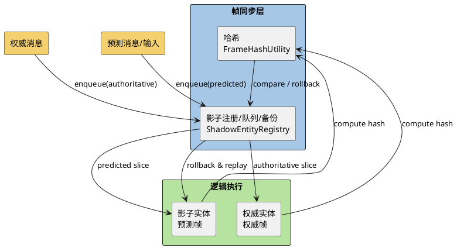

## Context

- 现有回滚基于全局世界，实体间交互紧耦合，回滚成本高。
- 消息交互已抽象为队列，可按实体拆分并携带帧号；本地实体预测需支持被否决/延迟时的快速回滚。
- 两阶段需求：先实现仅本地实体零延迟预测（远端延迟消费），再扩展到影子实体预测交互并与权威对齐。

## Goals / Non-Goals

- Goals: 按实体、按帧管理消息队列；阶段一仅预测自己（含自影子），阶段二可预测其他实体（含他人影子）；影子哈希对齐与回滚重放；回滚触发策略与无输入实体处理。
- Non-Goals: 全局物理重放优化、网络协议大规模重构、UI/可视化工具。

## Decisions

- 消息帧戳：所有对战消息携带权威帧号；队列按实体+帧分片，支持备份与重放。服务器下发的消息全部是权威消息。
- 阶段一（仅预测自己）：为本地实体创建影子实体（影子ID = -entityId），影子在预测帧运行，原始实体仅按权威帧运行；影子产生的预测消息不作用于权威实体；权威追平时比对原始 vs 影子哈希，不一致则影子回滚到权威帧并用备份重放。
- 阶段二（预测他人）：在阶段一基础上允许为被作用的其他实体创建影子；影子与对应权威实体比对哈希，不一致回滚重放；一致时收敛后销毁。
- 回滚触发：按权威帧批次触发，而非每条第三方输入；无输入/AI 实体保持权威驱动，不进入预测/影子。
- 状态校验：帧级哈希比较限制为必要字段，确保预测/权威一致性检查轻量。

## Risks / Trade-offs

- 风险：影子实体内存/CPU 开销；哈希字段选择不当导致误判或漏判。
- 缓解：仅在需要零延迟交互时创建影子；对哈希字段做最小覆盖列表并提供采样开关；超时或频繁不一致时回退到纯权威模式。

## Migration Plan

- 预备阶段：清理/下线现有“全局世界预测回滚”路径，确保不会与按实体队列方案并存；保留权威回放与快照校正。
- 阶段一先行：只影响本地实体与消息帧戳，保证影子回滚重放通过后再启用预测他人。
- 阶段二按场景逐步开关：为关键交互开启他人影子，比对稳定后默认关闭影子。
- 验证通过后再推广到更多实体/场景。

## Open Questions

- 影子实体哈希字段的最小集合是否需要含动画/特效同步信息？
- 预测帧队列的最大缓存窗口（帧数）取值与内存上限？
- 是否需要对远端消费延迟的反馈（如 UI 提示）？

---

# 架构、文件与核心函数

## 文件与模块改动（建议落点）

- 网络协议/权威快照：
  - `AstrumProj/Assets/Script/AstrumClient/Managers/GameModes/Handlers/FrameSyncHandler.cs`：仅处理帧同步协议消息、启动/停止、分发权威帧数据，不承载预测/回滚逻辑。
  - `AstrumProj/Assets/Script/AstrumClient/MessageHandlers/WorldSnapshotStartHandler.cs`、`WorldSnapshotChunkHandler.cs`：接收权威世界快照。
- 核心帧同步逻辑：
  - `AstrumProj/Assets/Script/AstrumLogic/Core/ClientLSController.cs`：落地按实体分片队列、影子预测/哈希比对、批次回滚驱动；挂接 LSInputSystem/FrameBuffer。
  - 新增/扩展基础模块（若无现成）：
    - `FrameSync/ShadowEntityRegistry.cs`：影子实体注册、消息队列与备份管理器（合并了队列管理功能）。注意：`Entity.EventQueue` 是 Entity 的一部分，会被回滚，不适合作为预测回滚的队列实现，因此使用独立的 ShadowEntityRegistry 管理。
    - `FrameSync/FrameHashUtility.cs`：帧级哈希字段选择与计算。
- 协议：
  - `AstrumConfig/Proto/gamemessages_C_2000.proto`：确保权威帧号字段；可选预测标记字段（供影子侧消费）。生成文件经 Proto2CS 生成（不直接改 Generated）。
- 配置（可选）：
  - 影子并发上限、预测超前窗口、哈希采样开关：复用现有 GameMode 配置或新增 `FrameSyncPredictConfig`。

## 核心数据结构/函数（代码示例）

### ShadowEntityRegistry（影子实体注册、消息队列与备份管理）

```csharp
// 新增：AstrumProj/Assets/Script/AstrumLogic/FrameSync/ShadowEntityRegistry.cs
namespace Astrum.LogicCore.FrameSync
{
    /// <summary>
    /// 影子实体注册、消息队列与备份管理器
    /// 
    /// 重要：这是独立于 Entity 的系统，不受实体回滚影响。
    /// - Entity.EventQueue 是 Entity 的一部分，会被回滚，不适合作为预测回滚的队列
    /// - 本管理器仅按 entityId（long）索引，不依赖 Entity 实例
    /// - 备份区也独立存储，用于影子实体的回滚重放
    /// </summary>
    public class ShadowEntityRegistry
    {
        private readonly World _world;
        
        // 影子映射：shadowId = -entityId -> Entity
        private readonly Dictionary<long, Entity> _shadowEntities = new Dictionary<long, Entity>();
        // 实体到影子的反向映射
        private readonly Dictionary<long, long> _entityToShadow = new Dictionary<long, long>();
        
        // 备份区：<entityId, Queue<FrameMessageBackup>>（存储已传给影子实体的用户输入，用于回滚重放）
        private readonly Dictionary<long, Queue<FrameMessageBackup>> _backupWindows 
            = new Dictionary<long, Queue<FrameMessageBackup>>();
        
        private readonly int _maxBackupWindowSize;
        
        public ShadowEntityRegistry(World world, int maxBackupWindowSize = 5)
        {
            _world = world;
            _maxBackupWindowSize = maxBackupWindowSize;
        }
        
        // ========== 备份管理方法 ==========
        
        /// <summary>
        /// 备份已传给影子实体的消息（主要用于用户输入）
        /// 
        /// 当用户输入传给影子实体执行时，需要调用此方法备份，用于回滚重放。
        /// </summary>
        public void BackupFrameSlice(long entityId, int frameId, List<EntityEvent> messages)
        {
            if (!_backupWindows.TryGetValue(entityId, out var backupWindow))
            {
                backupWindow = new Queue<FrameMessageBackup>();
                _backupWindows[entityId] = backupWindow;
            }
            
            backupWindow.Enqueue(new FrameMessageBackup { FrameId = frameId, Messages = messages });
            
            // 滑动窗口裁剪：超过 MaxPredictionFrames 则移除最旧备份
            while (backupWindow.Count > _maxBackupWindowSize)
                backupWindow.Dequeue();
        }
        
        // ========== 影子实体管理方法 ==========
        
        /// <summary>
        /// 确保实体有影子（不存在则创建）
        /// </summary>
        public Entity EnsureShadow(long entityId)
        {
            long shadowId = -entityId;
            
            if (_shadowEntities.TryGetValue(shadowId, out var existing))
                return existing;
            
            // 获取原始实体
            var original = _world.GetEntity(entityId);
            if (original == null)
                return null;
            
            // 创建影子实体（共享配置，独立状态）
            var shadow = _world.CreateEntity(shadowId);
            // 复制组件结构（只读配置共享，状态独立）
            CopyEntityStructure(original, shadow);
            
            _shadowEntities[shadowId] = shadow;
            _entityToShadow[entityId] = shadowId;
            
            return shadow;
        }
        
        /// <summary>
        /// 释放影子实体
        /// </summary>
        public void ReleaseShadow(long entityId)
        {
            if (!_entityToShadow.TryGetValue(entityId, out var shadowId))
                return;
            
            if (_shadowEntities.TryGetValue(shadowId, out var shadow))
            {
                _world.DestroyEntity(shadowId);
                _shadowEntities.Remove(shadowId);
            }
            
            _entityToShadow.Remove(entityId);
            
            // 清理该实体的备份
            _backupWindows.Remove(entityId);
        }
        
        /// <summary>
        /// 获取影子实体
        /// </summary>
        public Entity GetShadow(long entityId)
        {
            return _entityToShadow.TryGetValue(entityId, out var shadowId) 
                ? _shadowEntities.GetValueOrDefault(shadowId) 
                : null;
        }
        
        /// <summary>
        /// 回滚影子到指定帧
        /// </summary>
        public void RollbackShadow(long entityId, int targetFrame)
        {
            var shadow = GetShadow(entityId);
            if (shadow == null) return;
            
            // 从 FrameBuffer 加载该帧的快照
            var world = shadow.World;
            var snapshot = world.Room?.LSController?.FrameBuffer?.Snapshot(targetFrame);
            if (snapshot == null) return;
            
            // 恢复影子状态
            var loadedWorld = world.LoadFromSnapshot(snapshot);
            if (loadedWorld != null)
            {
                var restoredShadow = loadedWorld.GetEntity(-entityId);
                if (restoredShadow != null)
                {
                    CopyEntityState(restoredShadow, shadow);
                }
            }
        }
        
        /// <summary>
        /// 重放影子消息/输入（从备份区获取指定帧范围的数据）
        /// </summary>
        public void ReplayShadow(long entityId, int fromFrame, int toFrame)
        {
            var shadow = GetShadow(entityId);
            if (shadow == null) return;
            
            // 从备份区获取指定帧范围的数据
            if (!_backupWindows.TryGetValue(entityId, out var backupWindow))
                return;
            
            var backups = backupWindow
                .Where(b => b.FrameId > fromFrame && b.FrameId <= toFrame)
                .OrderBy(b => b.FrameId)
                .ToList();
            
            // 按帧分组并按顺序重放
            foreach (var backup in backups)
            {
                foreach (var evt in backup.Messages)
                {
                    shadow.QueueEvent(evt.EventData);
                }
                // 执行该帧逻辑
                shadow.World.FrameTickForEntity(shadow.EntityId, backup.FrameId);
            }
        }
        
        /// <summary>
        /// 比对影子与权威实体的帧哈希
        /// </summary>
        public bool CompareHash(long entityId, int frameId)
        {
            var original = _world.GetEntity(entityId);
            var shadow = GetShadow(entityId);
            
            if (original == null || shadow == null)
                return false;
            
            var originalHash = FrameHashUtility.Compute(original, frameId);
            var shadowHash = FrameHashUtility.Compute(shadow, frameId);
            
            return originalHash == shadowHash;
        }
        
        private void CopyEntityStructure(Entity source, Entity target) { /* 复制组件结构 */ }
        private void CopyEntityState(Entity source, Entity target) { /* 复制状态数据 */ }
    }
    
    // 备份数据结构
    public class FrameMessageBackup
    {
        public int FrameId { get; set; }
        public List<EntityEvent> Messages { get; set; }
    }
}
```

### FrameHashUtility（帧级哈希计算）

```csharp
// 新增：AstrumProj/Assets/Script/AstrumLogic/FrameSync/FrameHashUtility.cs
namespace Astrum.LogicCore.FrameSync
{
    public static class FrameHashUtility
    {
        /// <summary>
        /// 计算实体在指定帧的哈希值（关键字段）
        /// </summary>
        public static int Compute(Entity entity, int frameId)
        {
            if (entity == null) return 0;
            
            var hash = new HashCode();
            
            // 位置/朝向
            if (entity.TryGetComponent<TransformComponent>(out var transform))
            {
                hash.Add(transform.Position.X);
                hash.Add(transform.Position.Y);
                hash.Add(transform.Rotation);
            }
            
            // 速度
            if (entity.TryGetComponent<VelocityComponent>(out var velocity))
            {
                hash.Add(velocity.VelocityX);
                hash.Add(velocity.VelocityY);
            }
            
            // 动作/技能状态
            if (entity.TryGetComponent<ActionStateComponent>(out var actionState))
            {
                hash.Add(actionState.CurrentActionId);
                hash.Add(actionState.ActionFrame);
            }
            
            // 公共属性（HP、buff 标识等）
            if (entity.TryGetComponent<HealthComponent>(out var health))
            {
                hash.Add(health.CurrentHP);
            }
            
            if (entity.TryGetComponent<BuffComponent>(out var buffs))
            {
                foreach (var buffId in buffs.ActiveBuffIds)
                    hash.Add(buffId);
            }
            
            return hash.ToHashCode();
        }
        
        /// <summary>
        /// 使用字段掩码计算（可选，用于调优）
        /// </summary>
        public static int Compute(Entity entity, int frameId, FrameHashFieldsMask mask)
        {
            // 根据 mask 选择性计算字段
            // ...
        }
    }
    
    [Flags]
    public enum FrameHashFieldsMask
    {
        Position = 1 << 0,
        Rotation = 1 << 1,
        Velocity = 1 << 2,
        ActionState = 1 << 3,
        Health = 1 << 4,
        Buffs = 1 << 5,
        All = Position | Rotation | Velocity | ActionState | Health | Buffs
    }
}
```

### ClientLSController 扩展（集成队列、影子、回滚）

```csharp
// 修改：AstrumProj/Assets/Script/AstrumLogic/Core/ClientLSController.cs
public class ClientLSController : ILSControllerBase
{
    // ... 现有字段 ...
    
    // 新增：影子注册表（包含消息队列与备份管理）
    private ShadowEntityRegistry _shadowRegistry;
    
    public ClientLSController()
    {
        // ... 现有初始化 ...
        _shadowRegistry = new ShadowEntityRegistry(Room?.MainWorld, MaxPredictionFrames);
    }
    
    /// <summary>
    /// 预测主循环（扩展：集成影子预测与队列消费）
    /// </summary>
    public void Tick()
    {
        if (!IsRunning || IsPaused || Room == null) return;
        
        long currentTime = TimeInfo.Instance.ServerNow() + TimeInfo.Instance.RTT / 2;
        
        while (true)
        {
            if (currentTime < CreationTime + (PredictionFrame + 1) * LSConstValue.UpdateInterval)
                return;
            
            if (PredictionFrame - AuthorityFrame > MaxPredictionFrames)
                return;
            
            ++PredictionFrame;
            
            // 获取该预测帧的输入
            OneFrameInputs oneFrameInputs;
            using (new ProfileScope("ClientLS.GetOneFrameMessages"))
            {
                oneFrameInputs = _inputSystem.GetOneFrameMessages(PredictionFrame);
            }
            
            // 保存状态（用于回滚）
            using (new ProfileScope("ClientLS.SaveState"))
            {
                SaveState();
            }
            
            // 阶段一：为本地玩家实体创建/获取影子
            if (Room.MainPlayerId > 0 && _inputSystem.ClientInput != null)
            {
                var playerEntityId = GetPlayerEntityId(Room.MainPlayerId);
                var shadow = _shadowRegistry.EnsureShadow(playerEntityId);
                
                if (shadow != null)
                {
                    // 用户输入同时传给影子实体
                    // 将输入转换为 EntityEvent（或直接作为输入消息）
                    var inputEvent = ConvertInputToEntityEvent(_inputSystem.ClientInput, PredictionFrame);
                    
                    // 传给影子实体执行
                    shadow.QueueEvent(inputEvent.EventData);
                    shadow.World.FrameTickForEntity(shadow.EntityId, PredictionFrame);
                    
                    // 记录到 ShadowEntityRegistry 作为备份（用于回滚重放）
                    var inputMessages = new List<EntityEvent> { inputEvent };
                    _shadowRegistry.BackupFrameSlice(playerEntityId, PredictionFrame, inputMessages);
                }
                
                // 发布预测帧数据（通过网络上传）
                using (new ProfileScope("ClientLS.PublishFrameData"))
                {
                    _inputSystem.ClientInput.Frame = PredictionFrame;
                    _inputSystem.ClientInput.PlayerId = Room.MainPlayerId;
                    
                    var eventData = new FrameDataUploadEventData(PredictionFrame, _inputSystem.ClientInput);
                    EventSystem.Instance.Publish(eventData);
                }
            }
            
            // 权威实体执行（World Tick 时会直接消费权威消息，通过 Entity.EventQueue）
            Room.FrameTick(oneFrameInputs);
            
            if (TimeInfo.Instance.ServerNow() - currentTime > 5)
                return;
        }
    }
    
    /// <summary>
    /// 处理权威帧到达（扩展：触发影子哈希比对与回滚）
    /// </summary>
    public void HandleAuthoritativeFrame(int authorityFrame)
    {
        AuthorityFrame = authorityFrame;
        
        // 为所有有影子的实体进行哈希比对
        var entitiesWithShadows = _shadowRegistry.GetAllShadowedEntities();
        
        foreach (var entityId in entitiesWithShadows)
        {
            // 比对影子与权威在该帧的哈希
            bool isConsistent = _shadowRegistry.CompareHash(entityId, authorityFrame);
            
            if (!isConsistent)
            {
                // 不一致：回滚影子并重放
                _shadowRegistry.RollbackShadow(entityId, authorityFrame);
                
                // 从备份区获取并重放（ReplayShadow 内部会获取备份数据）
                _shadowRegistry.ReplayShadow(entityId, authorityFrame, PredictionFrame);
            }
            else
            {
                // 一致：影子继续前进（或进入收敛阶段）
                // 阶段二：可在此处处理收敛逻辑
            }
        }
    }
    
    /// <summary>
    /// 回滚（修改：仅回滚影子，不再回滚整个世界）
    /// </summary>
    public void Rollback(int frame)
    {
        // 仅回滚影子实体，不再回滚 Room.MainWorld
        var playerEntityId = GetPlayerEntityId(Room.MainPlayerId);
        
        if (playerEntityId > 0)
        {
            _shadowRegistry.RollbackShadow(playerEntityId, frame);
            
            // 重放备份区间（ReplayShadow 内部会获取备份数据）
            _shadowRegistry.ReplayShadow(playerEntityId, frame, PredictionFrame);
        }
        
        // 发布回滚事件（通知 View 层）
        var rollbackEvent = new WorldRollbackEventData(
            Room.MainWorld.WorldId, 
            Room.MainWorld.RoomId, 
            frame);
        EventSystem.Instance.Publish(rollbackEvent);
    }
    
    /// <summary>
    /// 将用户输入转换为 EntityEvent（用于传给影子实体）
    /// </summary>
    private EntityEvent ConvertInputToEntityEvent(LSInput input, int frameId)
    {
        // 将 LSInput 转换为对应的 EntityEvent
        // 例如：PlayerInputEvent { MoveX, MoveY, Attack, Skill1, ... }
        // ...
        return new EntityEvent
        {
            Frame = frameId,
            IsAuthoritative = false, // 用户输入是预测消息
            EventData = new PlayerInputEvent { /* 从 input 填充 */ }
        };
    }
    
    private long GetPlayerEntityId(long playerId)
    {
        // 根据 playerId 查找对应的 entityId
        // ...
        return 0; // 示例
    }
}
```

# 流程（预备 → 阶段一 → 阶段二）

- 预备：关闭/移除全局世界预测回滚，保留权威回放与快照校正，接入按实体分片队列（ClientLSController 驱动，FrameSyncHandler 负责协议与启动）。
- 阶段一（仅自影子，shadowId=-entityId）：
  1) 用户输入处理：
     - 获取用户输入（LSInput）→ 转换为 EntityEvent
     - 同时传给影子实体执行（`shadow.QueueEvent` + `FrameTickForEntity`）
     - 通过网络上传（`FrameDataUploadEventData`）
     - 传给影子实体时，记录到 `ShadowEntityRegistry.BackupFrameSlice` 作为备份（用于回滚重放）
  2) 消费：
     - 权威消息：World 在权威帧 Tick 时直接消费（通过 Entity.EventQueue），不通过 ShadowEntityRegistry
     - 预测消息（主要是用户输入）：直接传给影子实体执行，并备份到 ShadowEntityRegistry
  3) 回滚：权威帧追平且哈希不一致 → 影子回退到该帧 → 从备份区获取用户输入重放到当前预测帧 → 继续预测。
- 阶段二（预测他人，影子ID=-entityId）：
  1) 触发：命中/强交互白名单为目标实体建影子，影子消费预测消息。
  2) 对齐：权威帧比对哈希，不一致回滚影子重放，一致则收敛销毁。
  3) 降级：影子频繁不一致或开销超限，关闭他人影子，退回阶段一。

# PlantUML（层级示意）



# 阶段一设计：本地预测 + 延迟消费 + 单实体回滚

## 目标

- 本地实体零延迟预测执行；所有消息携带帧号并按实体分片。
- 对外消息标记预测帧，目标实体在权威帧追平后再消费，保持顺序一致。
- 输入被否决或帧被推迟时，回滚到最新权威帧，重放本实体消息/输入到预测帧。

## 数据结构与流程

- `ShadowEntityRegistry`: 管理备份区（滑动窗口，`<entityId, Queue<FrameMessageBackup>>`），存储已传给影子实体的用户输入，用于回滚重放。
- 用户输入处理路径：
  1) 获取用户输入（LSInput）→ 转换为 EntityEvent（预测消息）
  2) 同时传给影子实体执行（`shadow.QueueEvent` + `FrameTickForEntity`）
  3) 通过网络上传（`FrameDataUploadEventData`）
  4) 传给影子实体时，记录到 `ShadowEntityRegistry.BackupFrameSlice` 作为备份（用于回滚重放）
- 消费路径：
  - 权威消息：由 World 在权威帧 Tick 时直接消费（通过 Entity.EventQueue），不通过 ShadowEntityRegistry
  - 预测消息（主要是用户输入）：直接传给影子实体执行，并备份到 ShadowEntityRegistry；影子产生的预测消息不直接作用权威实体，需等权威帧下发后由权威实体生效。
- 回滚：触发条件=权威校正导致影子预测无效。步骤：1) 将影子状态回退到最新权威帧快照；2) 从备份区取出该影子在(权威帧, 预测帧]间的用户输入按帧重放；3) 推进预测帧。

## 校验与观测

- 队列一致性：同帧内顺序稳定，帧号不可倒序消费。
- 性能：备份窗口 = 预测超前最大帧差；必要时做滑动窗口回收。
- 观测指标：回滚次数、重放耗时、队列深度、超前帧差。

## 风险与缓解

- 回滚频繁：限制预测超前窗口；对高抖动客户端退回较低预测。
- 备份膨胀：窗口裁剪 + 压缩/池化。
- 延迟消费体验：必要时在 UI 提示“远端校正中”但不影响本地零延迟。

---

# 阶段二设计：影子实体预测交互 + 哈希对齐

## 目标

- 在需要零延迟跨实体交互时，为目标实体创建影子实体在预测帧执行。
- 权威实体正常按权威帧推进；权威追平预测帧时对同帧状态做哈希比对。
- 不一致则回滚影子实体到权威帧并重放备份消息/输入；一致后影子减速收敛并销毁。

## 数据结构与流程

- 影子实体：与权威实体共享只读配置，拥有独立状态/组件快照与消息队列（预测分片）。
- 哈希：选择最小关键字段集（位置/朝向/动作状态/可见公共属性）；每帧对影子与权威进行哈希对比。
- 预测执行：影子实体消费包含预测帧标记的消息，保持与本地发起者时序一致。
- 对齐流程：当权威帧=F
  1) 比对影子帧 F 哈希；若一致，进入“收敛”状态，逐帧将影子速度/状态插值回权威并销毁。
  2) 若不一致：影子回滚到权威帧快照 → 用备份消息/输入重放到帧 F → 重新比对 → 若连续多次不一致，可降级关闭影子，改为延迟消费模式。

## 策略与开关

- 触发策略：仅在强交互、需零延迟反馈的场景创建影子；按场景/技能白名单。
- 回滚批次：仍以权威帧为批次，不因多条第三方输入多次回滚。
- 降级策略：频繁不一致或开销超限 → 关闭影子，退回阶段一。

## 风险与缓解

- CPU/内存开销：影子数量上限 + 生命周期管控（收敛后即销毁）；可按房间并发限制。
- 哈希误判：字段覆盖过少 → 漏检；覆盖过多 → 误报。需调优字段集并可抽样。
- 状态发散：若影子持续不一致，切回延迟消费，避免无限回滚。
